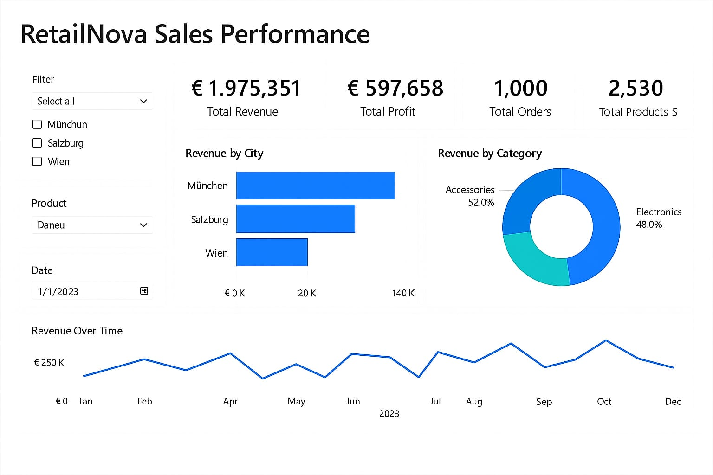

retailnova-sales-performance

This is a business data analysis project using Python and Power BI for the fictional company RetailNova.  
It focuses on understanding sales performance across different cities and product categories.

Project Summary

The project uses a structured dataset with 1,000 sales records. It includes revenue analysis, profit insights, city performance, and category breakdown. The results are visualized in a Power BI dashboard and explored in Python.

Files Included

retail_sales.csv            - The dataset used for analysis  
retail_analysis.ipynb       - Python notebook for data cleaning and exploration  
retailnova_dashboard.pbix   - Power BI dashboard with KPIs and charts  
visuals/RetailNova.png      - Dashboard screenshot  
requirements.txt            - Python libraries used  

Insights

- Hamburg and Berlin generate the highest revenue  
- Technology category has the strongest profit margin  
- Profit differences are affected by cost variation across cities  
- Sales tend to peak in Q2 and Q4  

Tools Used

Python (Pandas, Seaborn, Matplotlib)  
Jupyter Notebook  
Power BI Desktop  
GitHub  
